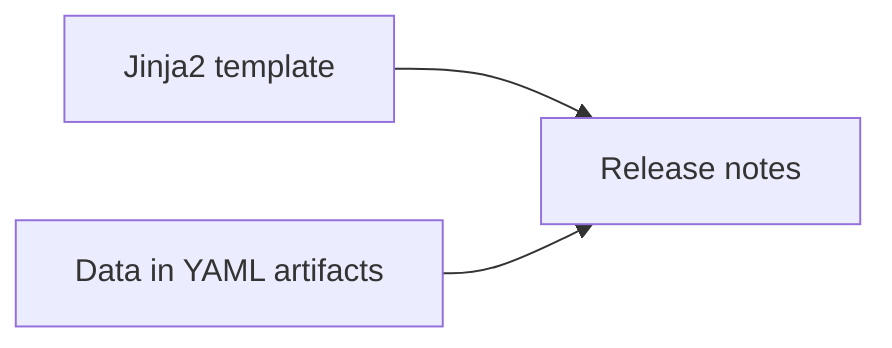

# Release notes automation

Tooling and workflow to automate release notes generation.

## Overview

This project eliminates the manual and error-prone process of compiling release notes.
Instead of relying on commit messages or ticket descriptions,
it generates documentation from structured YAML artifacts.

Release notes are generated by combining a Jinja2 template with data from artifacts.



The workflow is based on a simple, multi-artifact approach:

1. **Change artifacts:** With each pull request, a developer adds a YAML file
(`change-artifact.yaml`) describing their specific change.
2. **Release artifacts:** For each release, a release manager creates a YAML file
(`release-artifact.yaml`) that lists the change artifacts included in that release.
3. **Automation:** A GitHub Action is triggered when a release artifact is committed.
It reads the listed change artifacts, processes them through a template,
and automatically generates the release notes and opens a PR to add it to the repository.
4. Review and merge the PR.

There is an alternative script available for using a single artifact approach:
a YAML file for Change artifacts, Release artifacts, and product data.

## File structure

The key components of this repository are:

* `build_release_notes.py` -- The core Python script that powers the release notes generation logic
* `docs/release-notes` -- main files, including:
  * `template` -- folder for templates
  * `artifacts` -- folder for change artifacts
  * `releases` -- folder for release artifacts
  * `common.yaml` -- contains information common for all releases of a given product
  * `***.md` -- generated release notes
* `single-doc` -- folder for alternative script for combined YAML file.

If you copy them to a different location in your product's repository,
make sure to update GitHub workflow with correct path.

## Artifacts

Artifacts are used as a source of data to generate release notes using a Jinja2 template.

Artifact schemas can be adjusted or changed entirely depending on your project's needs and the template used.

> [!NOTE]
> The [default template](docs/release-notes/template/release-template.md.j2)
> and sample artifacts in this repository are designed for Juju charms.

### Template

A customizable Jinja2 template that defines the format and layout
of the generated release notes.

See
[docs/release-notes/template/release-template.md.j2](docs/release-notes/template/release-template.md.j2)
for example.

### Product information

Product information is similar for all release notes of the same product.
It is stored in the [docs/release-notes/common.yaml](docs/release-notes/common.yaml) file.

File structure:

```yaml
# Human-readable name of the charm
charm_name: ""

# Human-readable condition for the release (revision number, date, etc.)
release_condition: ""

# Boolean to determine whether internal changes will be rendered
show_internal: false
```

### Change artifacts

Individual change artifacts must have names with the format `pr####.yaml`, where
the number represents the pull request associated with the artifact.

File structure:

```yaml
# Version of the artifact schema
version_schema: 1

# The key holding the change(s)
changes:
  - title: "" # What goes into the header. No punctuation please
    author: "" # GitHub profile name
    type: "" # major, minor, deprecated, bugfix, breaking
    description: "" # Brief description of the chage or fix.
    urls: # Relevant URLs
      pr: "" # mandatory link to PR
      related_doc: "" # optional link to related documentation
      related_issue: "" # optional link to related issue
    visibility: public # determines whether artifact should be rendered. Accepted values: public, internal, hidden
    highlight: false # boolean to determine if change is highlight material (i.e. should be featureed in initial paragraph)
```

### Release artifacts

Release artifacts must have names with the format `release####.yaml`, where
the number will be used to tag the output file.

File structure:

```yaml
# --- Information about release ----

# list of change artifacts included in the release
included_changes:

# earliest revision included in the release
earliest_revision:

# latest revision included in the release
latest_revision:

# earliest date included in the release
earliest_date:

# latest date included in the release 
latest_date:
```

## Instructions

See below guides on how to set up and use the Release notes automation.

### Initial setup

Copy the `docs/release-notes` folder to the root of the source code repo of the product.

Copy the `.github/workflows/ReleaseNotes.yml` file into the GitHub workflows folder
in the same repository.

Adjust the Jinja2 template and `common.yaml` files for your product needs.

Delete all sample artifacts from `artifacts` and `releases` folders.
Delete all previously generated release notes (`***.md` files) from the `release-notes` folder.

### Usage

To generate release notes you need to:

* Perform initial setup (see above)
* Document every meaningful change as a change artifact
* Create a release artifact
* Adding release artifact should trigger GitHub workflow and generate release notes
* Check the PR that was created, adjust if needed, and merge to save final result.

## GitHub workflow

Here is the outline of the workflow used to generate release notes
and open a PR for adding them to the repository:

```yaml
name: 'Create release notes'

on:
  push:
    branches:
      - 'main'
    paths:
      - '<path to your release notes artifacts>'

jobs:
  release-notes:
    uses: canonical/release-notes-automation/.github/workflows/action.yml@main
    secrets: inherit
    with:
      change-artifact-dir: <directory to change artifacts>
      release-output-dir: <directory to release notes>
      release-artifact-dir: <directory to release artifacts>
      common-file: <full path to common.yaml file>
      template-dir: <directory to release notes template>
      template-file-name: <name of release notes template>
```

The `on: push: paths:` parameter triggers the workflow on any change to the path,
and it should be set to your release artifacts folder.

## Manual run

To run the script manually:

```bash
python3 build_release_notes.py
```

Usage and options:

```bash
usage: build_release_notes.py [-h] [-a ARTIFACTDIR] [-o OUTPUTDIR] [-r RELEASEDIR] [-c COMMONFILE] [-t TEMPLATEDIR] [-f TEMPLATEFILE]

Generates release notes based on multiple artifacts

options:
  -h, --help            show this help message and exit
  -a ARTIFACTDIR, --artifactdir ARTIFACTDIR
                        the directory where your change artifacts live
  -o OUTPUTDIR, --outputdir OUTPUTDIR
                        the directory where the rendered output will live
  -r RELEASEDIR, --releasedir RELEASEDIR
                        the directory where your release artifacts live
  -c COMMONFILE, --commonfile COMMONFILE
                        full path to the YAML file with keys common among all artifacts
  -t TEMPLATEDIR, --templatedir TEMPLATEDIR
                        directory where your release notes template lives
  -f TEMPLATEFILE, --templatefile TEMPLATEFILE
                        name of release notes template file
```

The default settings:

* `--artifactdir`: `docs/release-notes/artifacts`
* `--outputdir`: `docs/release-notes`
* `--releasedir`: `docs/release-notes/releases`
* `--commonfile`: `docs/release-notes/common.yaml`
* `--templatedir`: `docs/release-notes/template`
* `--templatefile`: `release-template.md.j2`

## Combined artifact approach

**Warning**: this feature is experimental.

Alternative tooling and materials to use a single input artifact for a release
are stored in the `single-doc` directory.

In this approach we can use a single input YAML file, that combines:

* product information (`common.yaml`),
* release artifact(`release####.yaml`),
* and change artifacts (`pr####.yaml`).

Schema example:

```yaml
# Human-readable name of the charm
charm_name: ""

# Human-readable condition for release (revision number, date, etc.)
release_condition: ""

# Machine-friendly identifier to distinguish individual release notes
release_tag: ""

# Details about the change in this artifact
changes:
  - title: "" # What goes into the header. Should be short (TBD)
    author: "" # GitHub profile name
    type: "" # major, minor, deprecated, bugfix, breaking
    description: "" # Brief description of the chage or fix.
    url: "" # Link to PR or commit
```
